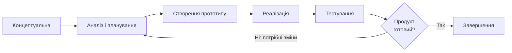

# Життєвий цикл проєкту StudentSwap

## 1. Обрана модель життєвого циклу

**Конкретна модель:** макетування (прототипування).

**Тип моделі за сучасною класифікацією:** ітеративна.

Для проєкту StudentSwap було обрано ітеративну модель із використанням прототипування. Проєкт є невеликим веб-застосунком, який виконується в межах навчального курсу, а вимоги до нього мають середній рівень невизначеності. Створення прототипу дозволить спочатку перевірити основну структуру та зручність взаємодії з продуктом, а потім поступово уточнювати його функціональність. Такий підхід також зручний через те, що проєкт виконується одним учасником і не потребує складної організації великої команди.

## 2. Фази життєвого циклу

| № | Назва фази                           | Мета фази                                                               | Тривалість (тижнів) | Ключові роботи                                                                       | Deliverables (проміжні результати)          | Відповідальний            |
| - | ------------------------------------ | ----------------------------------------------------------------------- | ------------------: | ------------------------------------------------------------------------------------ | ------------------------------------------- | ------------------------- |
| 1 | Концептуальна                        | Визначити основну ідею, проблему та цільову аудиторію                   |                   1 | Аналіз проблеми, визначення цільової аудиторії, формування основної ідеї             | `project-brief.md`                          | Project Manager / Analyst |
| 2 | Аналіз і планування                  | Визначити основні вимоги та функції продукту                            |                   1 | Аналіз аналогів, визначення вимог, визначення пріоритетних функцій                   | Перелік вимог та функціональності           | Analyst / Product Owner   |
| 3 | Створення прототипу                  | Створити початковий варіант інтерфейсу та перевірити структуру продукту |                   1 | Проєктування сторінок, навігації та основних елементів інтерфейсу                    | Прототип StudentSwap                        | Designer / Developer      |
| 4 | Реалізація основної функціональності | Створити працездатну версію основних функцій                            |                   3 | Розробка авторизації, оголошень, пошуку, фільтрації та профілю користувача           | Робоча версія веб-застосунку                | Developer                 |
| 5 | Тестування та доопрацювання          | Перевірити роботу застосунку та виправити виявлені проблеми             |                   1 | Функціональне тестування, пошук помилок, виправлення недоліків, перевірка інтерфейсу | Протестована версія продукту                | Developer / Analyst       |
| 6 | Завершення                           | Підготувати фінальну версію та документацію                             |                   1 | Фінальна перевірка, оформлення документації, підбиття підсумків                      | Фінальна версія StudentSwap та документація | Project Manager           |

## 3. Ворота між фазами

| Ворота | Між фазами      | Критерії переходу                                                                                | Можливі рішення    |
| ------ | --------------- | ------------------------------------------------------------------------------------------------ | ------------------ |
| G1     | Фаза 1 → Фаза 2 | Визначено проблему, цільову аудиторію та основну ідею продукту                                   | Go / Rework / Kill |
| G2     | Фаза 2 → Фаза 3 | Визначено основні вимоги та функції, сформовано початковий план продукту                         | Go / Rework / Kill |
| G3     | Фаза 3 → Фаза 4 | Основні екрани та структура прототипу готові, визначено логіку взаємодії користувача із системою | Go / Rework / Kill |
| G4     | Фаза 4 → Фаза 5 | Основна функціональність реалізована та може бути перевірена                                     | Go / Rework / Kill |
| G5     | Фаза 5 → Фаза 6 | Основні помилки виправлені, функції працюють відповідно до вимог                                 | Go / Rework / Kill |

## 4. Візуалізація життєвого циклу

## 5. Обґрунтування вибору моделі

Для StudentSwap було обрано ітеративну модель із прототипуванням, оскільки на початку проєкту не всі вимоги є остаточно визначеними. Під час створення прототипу можна перевірити, наскільки зручно користувачеві знаходити товари, переглядати оголошення та створювати власні. Після цього окремі рішення можна змінити до початку або під час основної розробки.

Також розглядалася каскадна модель Waterfall. Вона була б простішою для планування, але для StudentSwap її використання менш зручне, оскільки зміни вимог після завершення попередніх етапів могли б призвести до додаткової роботи. Іншим можливим варіантом є Scrum, але для невеликого навчального проєкту, який виконується одним учасником, повноцінне використання Scrum не є необхідним.

Основною перевагою обраної моделі є можливість поступово уточнювати продукт. Спочатку можна створити простий прототип, потім реалізувати основні функції та перевірити їх у роботі. Це дозволяє не витрачати багато часу на функції, які можуть виявитися непотрібними або потребуватимуть змін.

Основними ризиками є збільшення обсягу роботи, зміна вимог та нестача часу через те, що проєкт виконується одним учасником. Для зменшення цих ризиків планується спочатку реалізувати тільки основні функції StudentSwap, а додаткові можливості додавати після того, як базова версія буде готова.
